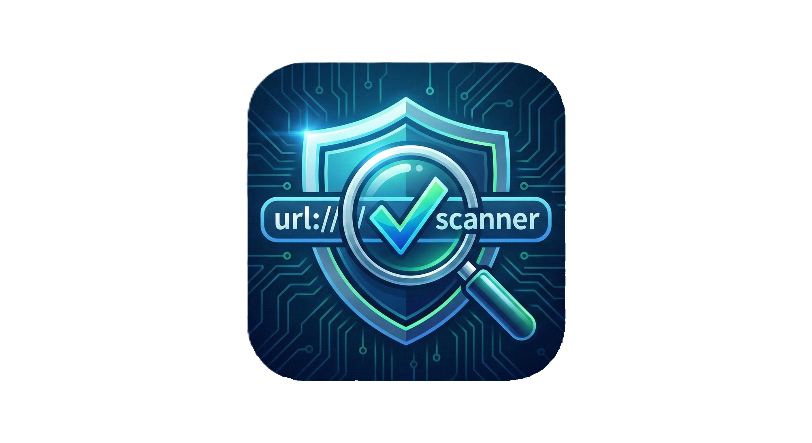

<p align="center">
  
</p>

# URL Analysis Tool

The **Safe-BrowsI** is a security tool that uses VirusTotal and Google Safe Browsing data to check if web links are safe. Instead of just doing a basic lookup, it compares results from different sources and shows you how risky a link is using a scoring system. This helps filter out false positives and gives you a clearer picture of the threat level.

## Quick Start

- For users who want to run the tool directly without setting up a Python environment:

- Download Standalone Executable (.exe): [URL Analysis Tool - Latest Release](https://github.com/YanCyyff/Safe-BrowsI/releases/)

### Note: For the tool to work correctly, the .exe must be in the same folder as your .env file containing your API keys.

## Core Capabilities

- Multi-API Consensus: Checks both VirusTotal and Google data simultaneously for more reliable results.

- Weighted Risk Scoring: Rates threats based on the reliability of the source rather than just the raw detection count.

- Automated URL Submission: Automatically starts a new scan if a link has not been analyzed or indexed before.

- Rich UI: Presents results clearly through a terminal-based interface.

## Risk Assessment Methodology
1. The tool determines the risk of a link based on the following logic:

2. Google Safe Browsing Override: If Google flags a link as dangerous, the risk is set to 100% immediately, regardless of other results.

3. Consensus Threshold: If 5 or more engines on VirusTotal flag a link, it is classified as a "Confirmed Threat."

4. Tiered Heuristics: If only 1–4 engines report an issue, the link is marked as "Suspicious" to avoid unnecessary panic while still providing a warning.


## Installation & Configuration

**To run the tool from the source code, follow these steps:**

### Clone the Repository:

```git clone https://github.com/Yancyyff/Safe-BrowsI.git```

```cd Safe-BrowsI```

### Install Dependencies:

```pip install -r requirements.txt```

### API Configuration:

**Rename the .env.example file to .env and add your API keys:**

```VT_API_KEY=<your_api_key>```

```GOOGLE_SAFE_BROWSING_KEY=<your_api_key>```


## License

*This project is licensed under the MIT License.*
